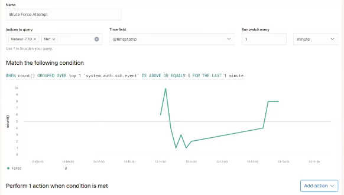

# Blue Team: Summary of Operations

## Table of Contents
- Network Topology
- Description of Targets
- Monitoring the Targets
- Patterns of Traffic & Behavior
- Suggestions for Going Further

### Network Topology

The following machines were identified on the network:
- Capstone
  - **Operating System**: Linux 4.15 - 5.6
  - **Purpose**:  Corporate Web Server and Kibana Web
  - **IP Address**: 192.168.1.105
- ELK
  - **Operating System**: Linux 4.15 - 5.6
  - **Purpose**: Monitoring Server (Elastic Stack)
  - **IP Address**: 192.168.1.100
- Target 1
  - **Operating System**: Linux 3.2 - 4.9
  - **Purpose**: Web Application Server 
  - **IP Address**: 192.168.1.110
  - Target 2
  - **Operating System**: Linux 3.2 - 4.9
  - **Purpose**: Web Application Server 
  - **IP Address**: 192.168.1.115
  - Kali
  - **Operating System**: Linux 2.6.32
  - **Purpose**: Pentest Station
  - **IP Address**: 192.168.1.90
  - Jump Host
  - **Operating System**: Windows 10 Pro
  - **Purpose**: Gateway, HyperV Host, Jump Host, browser
  - **IP Address**: 192.168.1.1

### Description of Targets

Two VMs on the network were vulnerable to attack: `Target 1` (192.168.1.110) and `Target 2` (192.168.1.115).

Each VM functions has an Apache web server and has SSH enabled, so ports 80 and 22 are possible ports of entry for attackers. As such, the following alerts have been implemented:

### Monitoring the Targets

Traffic to these services should be carefully monitored. To this end, we have implemented the alerts below:

#### Name of Alert 1
 `HTTP Response Count`
Alert 1 is implemented as follows:
  - **Metric**: http.response.status_code [filebeat]
  - **Threshold**: 400 in the last 5 minutes
  - **Vulnerability Mitigated**: Volumes of HTTP Requests (web server is open to intensive scans)
  - **Reliability**: Moderate, this alert generates may generate a false positives when we have abnormally high demand.
    This alert should be tuned to remain effective around peak load periods.
    

#### Name of Alert 2
 `HTTP Request Bytes`
Alert 2 is implemented as follows:
  - **Metric**: http.response.status_code [filebeat]
  - **Threshold**: 3500 in the last 1 minute
  - **Vulnerability Mitigated**: Volumes of HTTP Requests (web server is open to intensive scans)
  - **Reliability**: Moderate, this alert generates may generate a false positives when we have abnormally high demand.
    This alert should be tuned to remain effective around peak load periods.
    

#### Name of Alert 3
 `Brute Force Attempt`
Alert 3 is implemented as follows:
  - **Metric**: system.auth.ssh.event [filebeat]
  - **Threshold**: 5 in last 1 minute
  - **Vulnerability Mitigated**: No login restrictions (open to brute force attacks)
  - **Reliability**: Medium, this alert generated no false positives for the period.
    This alert should be tuned if it were triggered by valid logins,coinciding at the start of a shift for example.
    
    

#### Name of Alert 4
 `WPScan`
Alert 4 is implemented as follows:
  - **Metric**: user_agent.original [packetbeat]
  - **Threshold**: 500 in the last 1 minute
  - **Vulnerability Mitigated**: enumeration of Web server, DOS attacks
  - **Reliability**: High, this alert generates no false positives.
    This alert could be triggered by authorised scans, a block-list entry would cover this.
    

### Suggestions for Going Further

The logs and alerts generated during the assessment suggest that this network is susceptible to several active threats, identified by the alerts above. In addition to watching for occurrences of such threats, the network should be hardened against them. The Blue Team suggests that IT implement the fixes below to protect the network:

- Vulnerability: Brute Force Login Accounts
  - **Patch**: install `fail2ban` with `sudo apt-get install fail2ban`
  - **Why It Works**: we configure fail2ban to harden entry point configuration which protects the server against attacks, SSHd in particular.
    First, we establish a base firewall configuration, being the default policy for the machine. Then we use fail2ban to set firewall rules in iptables.
  fail2ban is adaptive - it will respond to current traffic patterns by invoking a policies that bans suspicious IPs for a configured time period.
  An advantage of fail2ban is that we maintain our security configuration separate to our regular system configuration

- Vulnerability: Insecure configuration
  - **Patch**: install `lynis` with `sudo apt-get install lynis`
  - **Why It Works**: Insecure configuration is at the core of the bulk of CWE items detailed. Lynis can be used to audit configuration of the system, and of docker container files. The information you gather from lynis provides focus on securing configuration.
  ●	Run an audit: './lynis audit system –quick –auditor “Blue Team Member”'

- Vulnerability: Insufficient Security logging
  - **Patch**: install `auditd audispd-plugins` with `sudo apt-get install auditd audispd-plugins`
  - **Why It Works**: auditd facilitates security auditing via log files. auditd is a native tool that integrates with the kernel and logs system events, records configuration changes and file access. The information we can gather with auditd will enable us to learn more about system events and facilitate us to enhance our security baseline

## SSH configuration hardening

- Patch: install fail2ban 'sudo apt-get install fail2ban'

- Why It Works: we configure fail2ban to harden entry point configuration which protects the server against attacks, SSHd in particular. 

    First, we establish a base firewall configuration, being the default policy for the machine.  

    Then we use fail2ban to set firewall rules in iptables 

  fail2ban is adaptive - it will respond to current traffic patterns by invoking a policies that bans suspicious IPs for a configured time period.

  An advantage of fail2ban is that we maintain our security configuration separate to our regular system configuration

System component configuration hardening

## Apache Server configuration hardening

- Harden permissions on ServerRoot Directories
...'
mkdir /usr/local/apache (ServerRoot)
cd /usr/local/apache 
mkdir bin conf logs 
chown 0 . bin conf logs 
chgrp 0 . bin conf logs 
chmod 755 . bin conf logs
...'

- Harden permissions when you install httpd
...'
cp httpd /usr/local/apache/bin 
chown 0 /usr/local/apache/bin/httpd 
chgrp 0 /usr/local/apache/bin/httpd 
chmod 511 /usr/local/apache/bin/httpd
...'

●	Server Side Includes
SSI-enabled files should have a separate extension, such as .shtml
disable the ability to run scripts and programs from SSI pages

●	Check CGI scripts - CGI scripts can run essentially arbitrary commands on your system with the permissions of the web server.

●	Other dynamic content Embedded scripting options which run as part of the server itself, such as mod_php, mod_perl, mod_tcl, and mod_python, run under the identity of the server itself.  Scripts executed by these engines potentially can access anything the server user can, so use trusted code only here too.

●	Prevent the use of .htaccess files in all directories apart from those specifically enabled by adding the below to your server.conf
<Directory "/">
    AllowOverride None
</Directory>

●	Protect server files by default by adding the below to your server.conf
<Directory "/">
    Require all denied
</Directory>
The add appropriate Directory blocks to allow access only to specified areas
<Directory "/usr/users/*/public_html">
    Require all granted
</Directory>
<Directory "/usr/local/httpd">
    Require all granted
</Directory>
Ensure there are no Location directives that will overwrite the Directory blocks

●	The Protect your UserDir in server.conf
'UserDir disabled root'

●	Secure and watch your log files.  
An attacker may gain system information from reading server logs, so acccess to logs should be restricted via role-based access control.
Understanding your server logs will provide details of normal behaviour and make it easier to identify or rule out issues during an incident

 
## MySQL secure installation

MySQL should be installed via a secure installation which allows us to set security options during the installation.
MySQL secure installation may also be run for an existing installation.
	'sudo mysql_secure_installation'

Note: There is a choice of password validation policy levels included so ensure you are familiar and understand the selection you will make here.  Were an existing account to have problems after the secure installation (such as a database user for a running service like WordPress) we can change the database user password for the user/service with this command:
mysqladmin -u USER -p password NEWPASSWORD

Running MySQL secure installation;
●	Update the password plugin (Y and hit Enter)
●	Select the level of password validation policy you want to enable (0 = low, 1 = medium, 2 = strong).
●	Change the root password (to dismiss this option type N)
●	Remove anonymous users (Y to remove)
●	Disallow remote root login (Y to disable)
●	Remove test database (Y to remove)

## Hardening WordPress

WordPress has numerous features that can be exploited and a raft of plugins are available that can be used to remediate these vulnerabilities.  
●	Second factor authentication – prevents brute force attacks on user accounts 
●	Installing a WordPress security plugin such as "MalCare" will assist administrators with a clear interface to modify important settings
●	The first step is to scan and clean our website.    
●	Limiting Logins via a plugin like "Limit Login Attempts Reloaded" or by modifying functions.php
●	Block PHP execution in untrusted folders; add the following to /public_html/.htaccess
<Files *.php>
deny from all
</Files>
●	Disable file editor plugin via modifying wp-config
●	Mandate stronger passwords (via MalCare plugin)
●	Change security keys and encrypt wp-config (via MalCare plugin)
●	Prevent plugin installations – via edit of wp_config.php to add this line;
define(‘DISALLOW_FILE_MODS’,true);
●	Automatically log out inactive users - install a plugin such as Bullet Proof Security
●	Audit logging - install plugin "WP Security Audit Log"
●	Set up a Web Application Firewall via a security plugin
●	Set up alerts for suspicious activity and malware detection (via MalCare plugin) 
●	Secure communications with Configure SSL Certificates, especially for any internet-based requests

## Update to current versions of component software

- Patch: install security updates for installed components

- Why It Works:  Maintaining current versions for openssl, Apache, MySQL, Wordpress, etc; will remediate most of the platform vulnerabilities discovered.

●	Vendors release supported patches / fixes in response to reported vulnerabilities. 

●	Installation can be standardised and automated via Ansible playbook or other centralised distribution

